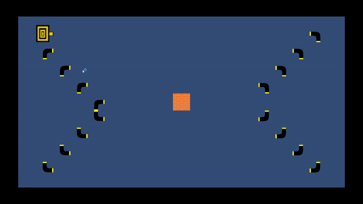
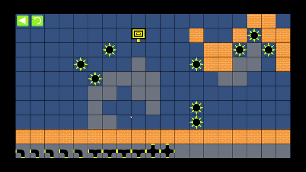

# Laser_Spel

## About the game

Enjoy a strategic game with 40 levels developed with love. The game is based on an original idea and the goal is to redirect a laser to hit all of the wheels. Don't worry, you have some tools to your disposal. Use pipes to redirect the laser, portals to teleport the laser and switches to completely change the game field. More and more tools are introduced as you advance in the game and move on to more challenging levels. Sadly it won't be easy, so put on your game face and try to beat them all.

## About the project

This is the first game I have developed and the purpose was to learn how to develop an entire game, from scripting to building. In this project I learnt all the basics there is to developing a game in Unity such as handling mouse input, switching between scenes and writing scripts. I also got to apply some skills that I didn't think that I would have when I first started the project; There was some mathematics involved when for example determining if the mouse was hovering over a piece or determining if the mouse was purposefully dragging a piece or accidentally dragging the piece when rotating, I even got to apply some linear algebra.

I have not published any source code since the game contains some easter eggs (can you find them?).

## How to install the game

### Install on Windows

1. Go to the latest [release](https://github.com/Robert-Mellberg/Laser_Spel/releases/tag/1.0.0)
2. Download the compressed folder Laser_Spel.zip under "Assets"
3. Right click the folder and choose "Extract All"
4. Start the game by launching Laser Spel.exe

### Install on android

Unfortunately I haven't been able to upload an APK for Android for this game since I don't have Android SDK installed.

If you want an APK for the game, email me.

## Contact information
Robert Mellberg

robmel@kth.se

